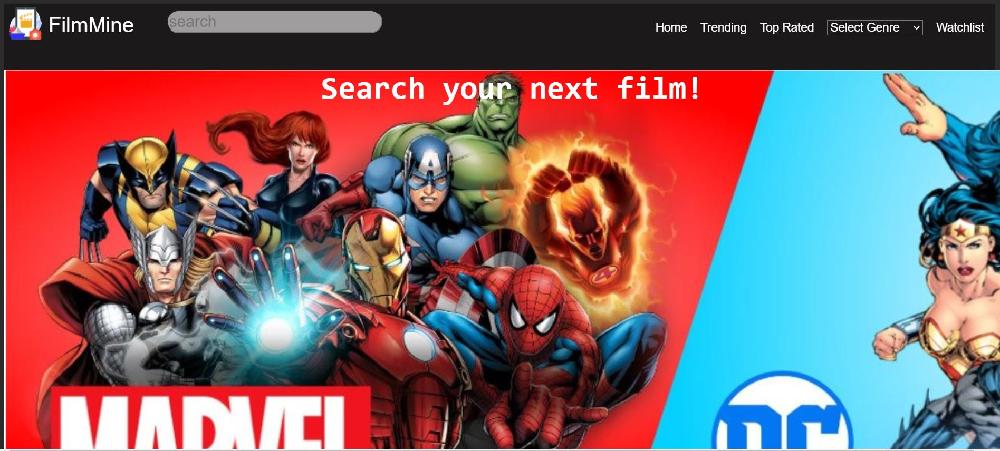

# FilmMine

FilmMine is a movie discovery application built with React. It allows users to browse trending movies, top-rated movies, and movies by genre. Users can also add movies to their personal watchlist.

## Features

- Browse trending movies
- View top-rated movies
- Browse movies by genre
- Add and remove movies from a personal watchlist
- Responsive design for mobile and desktop

## Project Structure

src/
├── components/
│ ├── GenresDropdown.jsx
│ ├── HomePageSlideShow.jsx
├── context/
│ └── WatchlistContext.jsx
├── view/
│ └── MoviesList.jsx
├── hooks/
│ └── useFetch.jsx
├── pages/
│ ├── Home.jsx
│ ├── MovieDetail.jsx
│ ├── TrendingMovies.jsx
│ ├── GenreMovies.jsx
│ └── TopRated.jsx
├── App.jsx
├── App.css
├── index.js
└── index.css
